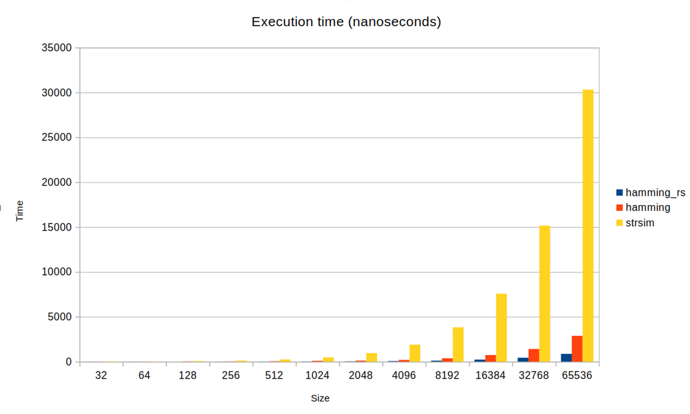
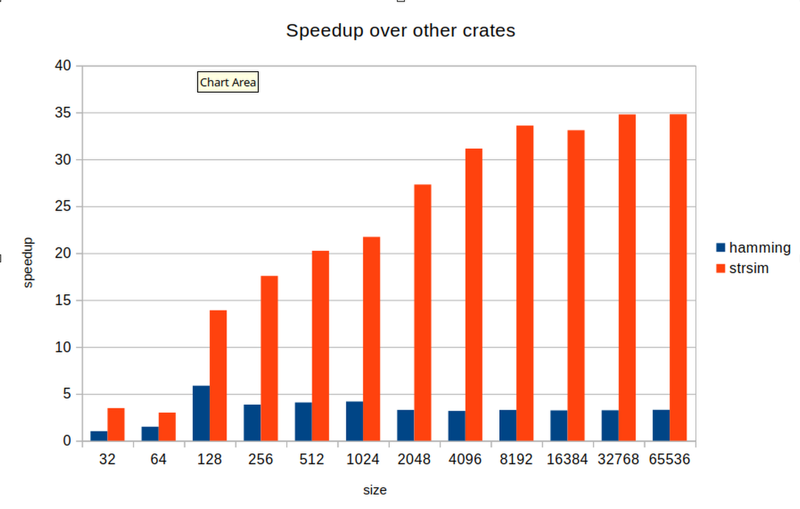

# hamming_rs
Computes hamming distance and weight, possibly with avx/avx2 instructions for x86 processors  
avx2 optimized version is used when inputs have same memory alignment and are large enough 
otherwise, functions will fallback to slower versions but still faster than `strsim` or `hamming` crates.

# references
Muła, Wojciech, Nathan Kurz, and Daniel Lemire. "Faster population counts using AVX2 instructions." The Computer Journal 61.1 (2018): 111-120.

https://arxiv.org/pdf/1611.07612.pdf

Thanks to @emschwartz (github), his fast implementation is now used when avx2 is not available. It allows auto-vectorization on non intel platforms.

# performances
We ran benchmarks with `cargo bench` on a laptop with a AMD Ryzen 5 PRO 5675U @4.4Ghz with 32Gb of RAM. 
Before that, we set `export RUSTFLAGS="-C target-feature=+avx2,+fma"`.
We compare ourselves against `hamming` and `strsim` reference crates.
We notice a speedup of \~3 against `hamming` and of \~30 against `strsim` 

