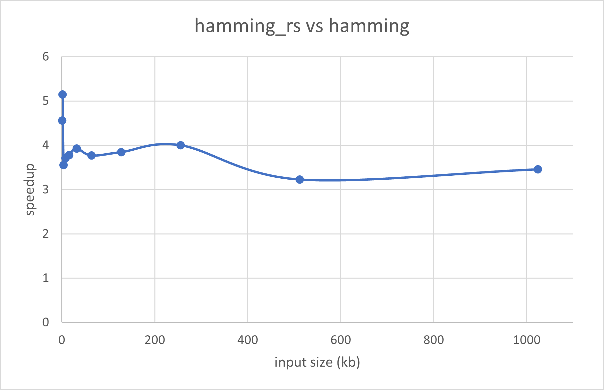
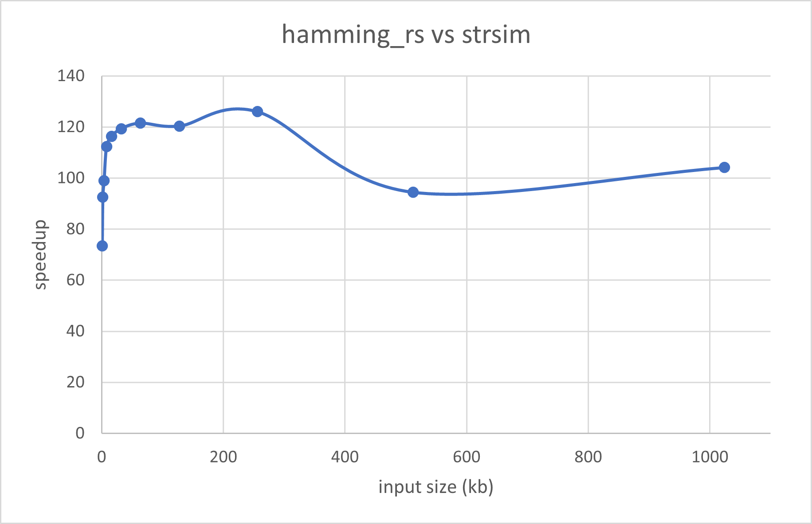

# hamming_rs
Computes hamming distance and weight, possibly with avx/avx2 instructions for x86 processors  
avx2 optimized version is used when inputs have same memory alignment  
otherwise, functions will fallback to slower versions  

# references
Muła, Wojciech, Nathan Kurz, and Daniel Lemire. "Faster population counts using AVX2 instructions." The Computer Journal 61.1 (2018): 111-120.

https://arxiv.org/pdf/1611.07612.pdf

# performances
We ran benchmarks with `cargo bench` on a laptop with a Intel core i7-8750H @2.2Ghz with 16Gb of RAM  
We compare the avx2 version (with inputs aligned to 256 bytes) against `hamming` and `strsim` reference crates  
We notice a speedup of \~4 against `hamming` and of \~100 against `strsim` 

